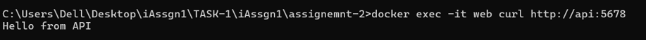
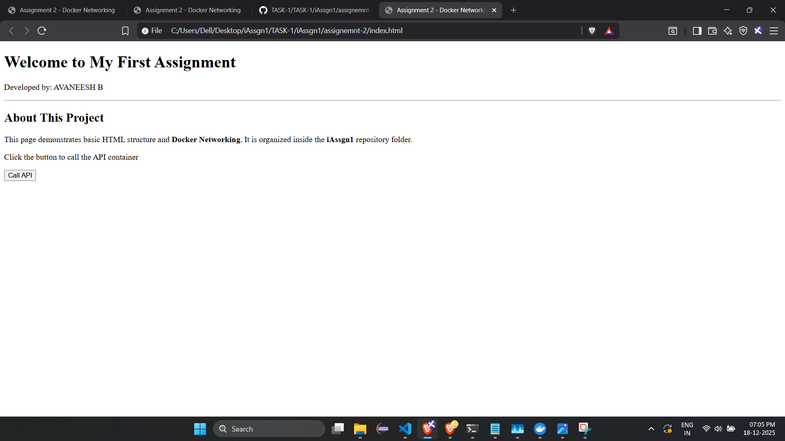
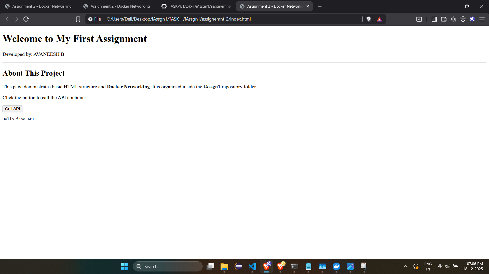
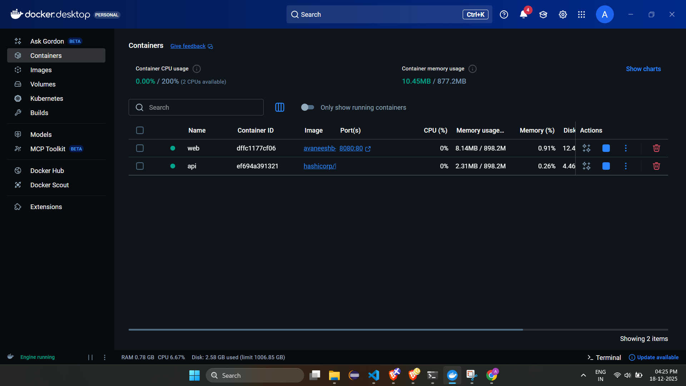

# Assignment 1: Nginx Docker Server

## Approach
Deploying two isolated containers — a frontend and a backend — connected via a dedicated virtual network.So created a custom bridge network (webnet) to enable the web container to discover and communicate with the api container.

## Folder Content
This folder follows the required structure and contains:
* **index.html**: Contains my name , a heading , a brief description and a functional Interactive Element (the button) and the JavaScript logic to fetch data from the API container.
* **Dockerfile**: Instructions to build the server image using Nginx.
* **nginx.conf**:

## Commands Used

### 1.Create a custom Docker network :
To create a network with the name avaneeshb-site:
```bash
docker network create webnet
```

### 2.Build Nginx image:
Build the image for the Nginx web server:
```bash
docker build -t avaneesh-site .
```

### 3.Run the Nginx Web Container:
To run a detached container named web on the webnet network , exposing port 8080 on the machine system with service provided at port 80 of the container: 
```bash
docker run -d --name web --network webnet -p 8080:80 avaneeshb-site
```

### 4.Run the API Container
Launch the API container on the webnet network.
```bash
docker run -d --name api --network webnet hashicorp/http-echo -text="Hello from API"
```

### 5.Testing
```bash
docker exec -it web curl http://api:5678
```

### 6.Screenshot of curl results


### 7.Screenshot of the webpage

Before clicking the api button


After clicking the api button


### 8.Screenshot of the running containers


### 9.Stop the containers
```bash
docker stop web
docker stop api
```

### 10.Destroy the containers
```bash
docker rm web
docker rm api
```
