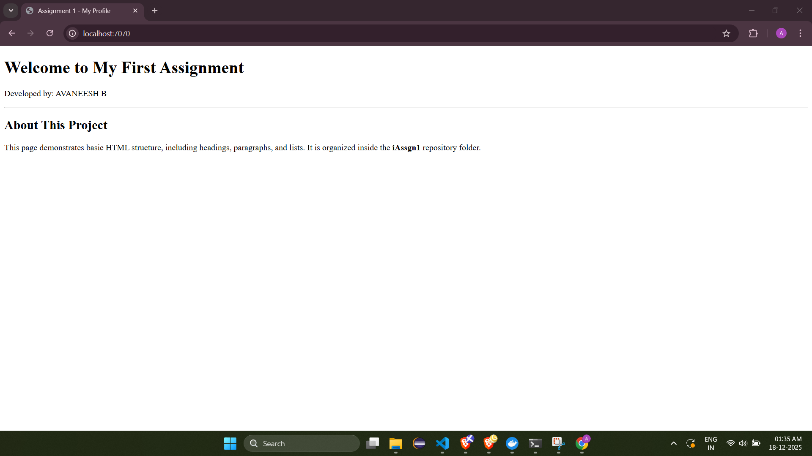
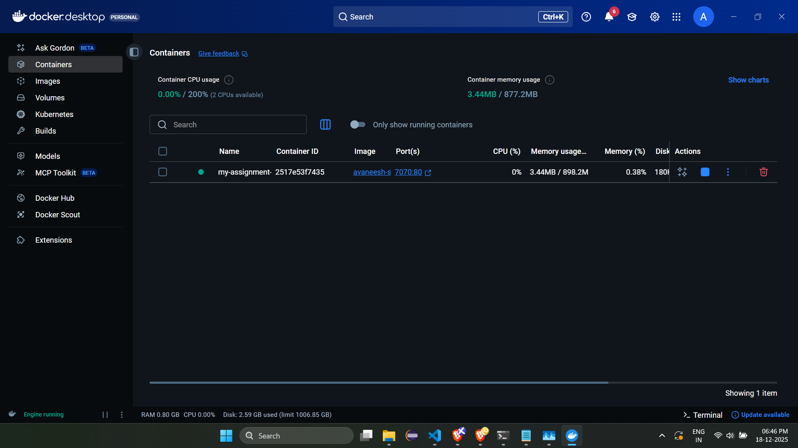

# Assignment 1: Nginx Docker Server

## Approach Explanation
For this task, I created a containerized web environment using Nginx. I prepared a custom `index.html` file and configured a `Dockerfile` to copy this file into the Nginx default directory.

(A docker container is isolated by design , so it cannot communicate with the local machine , so we use Port-mapping to map the default port present in the container to one of the ports of the local machine so that it can communicate with the local machine .)

## Folder Content
This folder follows the required structure and contains:
* **index.html**: Contains my name, a heading, and a brief description.
* **Dockerfile**: Instructions to build the server image using Nginx.
* **README.md**: This file, providing instructions and approach details.

## Commands Used

### 1. Build the Nginx Image
To build the image with the name avaneeshb-site:
```bash
docker build -t avaneesh-site .
```

### 2.Run the container
To run a detached container named my-assignment-container , exposing port 7070 on the machine system with service provided at port 80 of the container:
```bash
docker run -d -p 7070:80 --name my-assignment-container avaneesh-site
```
(the dafault port(80) of the container is ported to the port 7070 of the local machine .)

### 3.Testing
Open in browser : localhost:7070<br>
Or test via CLI
```bash
curl http://localhost:7070
```

### 4.Screenshot of curl results


### 5.Screenshot of the wesite


### 6.Screenshot of the running container


### 7.Stop the container
```bash
docker stop my-assignment-container
```

### 8.Destroy the container
```bash
docker rm my-assignment-container
```